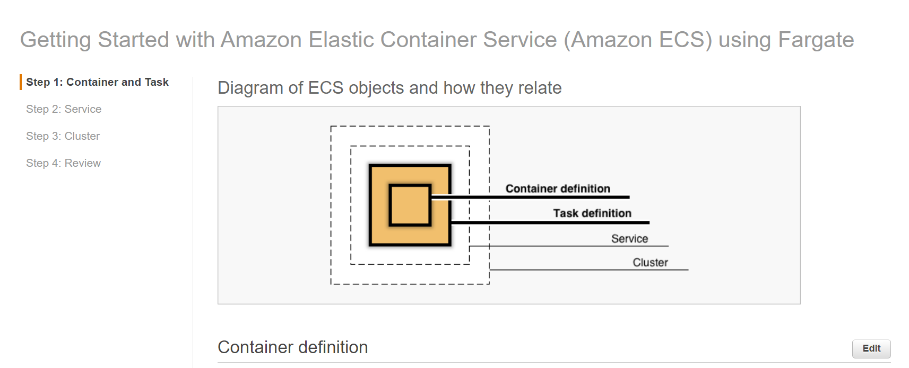
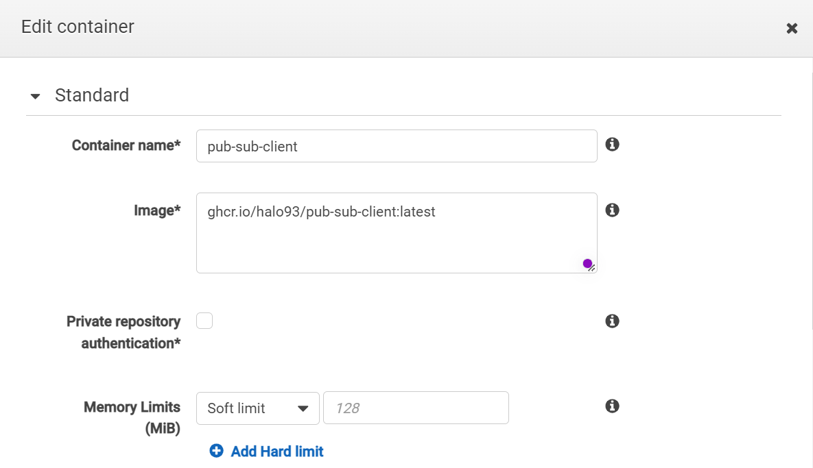
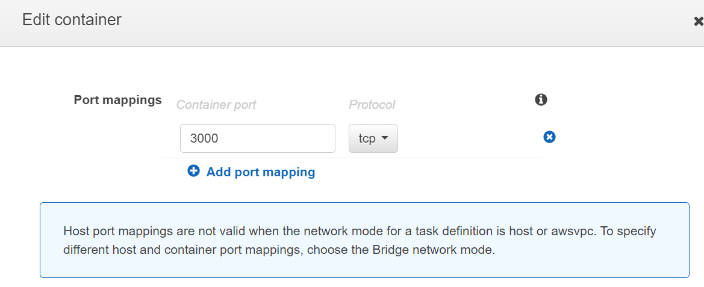

# Pub-sub client
Copyright by:
- Ha Long Do
- John Wannerkawahara
- Pavan Karnati
- Arsalan Ahmed

# Demo

https://user-images.githubusercontent.com/18458678/197408266-ca2b337d-3604-4c65-b430-32b037e03193.mp4


# Run your own client

## On your machine
To run your own client run the following on a system with docker installed

```console
docker run -d -p 3000:3000 ghcr.io/halo93/pub-sub-client:latest
```
Visit http://localhost:3000

## On AWS ECS Fargate

Using the [Amazon ECS first run wizard][first-run], create an ECS cluster,
Use the task definition from file [ecs-task.json](ecs-task.json)



**✅ \  Step-by-step Instructions**

1. Go to the AWS Management Console, click **Services** then select **Elastic
   Container Service** under Compute. If you've never used the service before,
   you'll see a **Getting started** button which will take you to the first run
   wizard. If you do not see this button, [navigate to the wizard
   directly][first-run].

2. The first page of the wizard outlines configuration details to build our new
   task definition. Select Custom. Enter the docker image link as **ghcr.io/halo93/pub-sub-client:latest**  Note that the task will run using the **FARGATE**
   launch type and it is configured for **0.5GB of RAM** and **1/4th of a
   vCPU**. Click **Next**.




3. The next page outlines configuration details for our service. By default it
   will create an app called **simple-app-service** running a single task in a
   new security group. Change it to **pub-sub-client** Note we can optionally create a load balancer here to distribute traffic across tasks in our service. We won't do this here but
   will later in the workshop. Leave the defaults and click **Next**.


4. The last page of the wizard allows us to name our cluster. Enter `pub-sub`
   into **Cluster name**. Click **Next**.


5. Review the details of the new task definition, service, and cluster on the
   next page and click **Create**.

6. The first run wizard will create the task definition, service, and cluster
   and all supporting infrastructure. It will show you its progress as it runs:

    Once complete, click **View service**.

7. Click on the **Tasks** tab to see the tasks running by the service. The task
   status will transition from **PROVISIONING** to **PENDING** to **RUNNING** as
   the task is placed within AWS Fargate, the container is pulled and started.
   Click the refresh button while the task starts.
   Open the public ip address on port 3000 to access the client.

